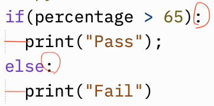

# Writing Conditional Statements 

** This lesson helps the student understand the writing orientation of conditional statements in python **

  _ Conditional statements are part of every programming language. With conditional statements, we can have code that sometimes runs and at other times does not run, depending on the conditions of the program at that time. _

Let us see where we have to use conditions:

1. If the student receives over 65% on her test, report that her grade passes; if not, report that her grade fails
   
2. If he has money in his account, calculate interest; if he doesn’t, charge a penalty fee
   
3. If they buy 10 oranges or more, calculate a discount of 5%; if they buy fewer, then don’t

#### Take the first case from the above scenarios

The simple thing here is either to **print** *pass* or *fail*

let's do it in your most familier language ***C***

---
```C
if(percentage > 65)
{
    printf("Pass\n");    
}
else
{
    printf("Fail\n");
}

```
---

Let's do the same thing in ***Python***

---
```python
if(percentage > 65):
  print("Pass");
else:
  print("Fail")
```
---

 

### From the above picture have you observed the markings

**:** colon and **indentation**

They play quite a good role in python. Particularly in the conditional statements **":"** indicates that the next lines should be the statements part of the condition. 

In ***C*** we use { open and } close, but in python ***Indentation*** (meaning a tab space) gives an idea the statement is part of condition. In the image i gave you a **Red** line for tab space

***Have you also observed that there is no "\n" in python print as it is by default, but if you what in the same line you can write***

---
```python

print("hi", end="") 
# indicates don't go to next line after print, but remain in the same line for the next print

```
---


#### Now Let's see another case 

_If they buy 20 oranges or more, calculate a discount of 10%; if they buy 10 oranges calculate a discount of 5%, if they buy less than 10 oranges calculate a discount of 2%_

Lets see how we do in ***C***

---
```C
float oranges_price = 5;
float total;
int no_of_choosen;
float discount_price;
scanf("%d",no_of_choosen);

if(oranges >= 20)
{
  total = oranges_price * no_of_choosen;
  discount_price = (total * 10)/100;
}
else if(oranges == 10)
{
  total = oranges_price * no_of_choosen;
  discount_price = (total * 5)/100;
}
else
{
  total = oranges_price * no_of_choosen;
  discount_price = (total * 2)/100;
}

```
---

Now let's write in ***python***

---
```python

float oranges_price = 5;
no_of_choosen = int(input())

if oranges >= 20:
  total = oranges_price * no_of_choosen
  discount_price = (total * 10)/100
elif oranges == 10:
  total = oranges_price * no_of_choosen
  discount_price = (total * 5)/100
else:
  total = oranges_price * no_of_choosen
  discount_price = (total * 2)/100

```
---


#### Let's take another case:

_ if you need to decide the grade of a student, how do you write in both ***C*** and ***python***

In ***C***

---
```C

if(marks >=80 && marks < 90)
{
  printf("A Grade\n")
}

```
---

in ***python***

---
```python

if(marks >=80 and marks < 90)
{
  print("A Grade")
}

```
---


What is the difference you found. Now based on your observation and difference between ***C*** and ***python*** structures write down a notes in main.py as multiline comments, explaining what you have observed

If possible test the python statements in ***main.py***


  